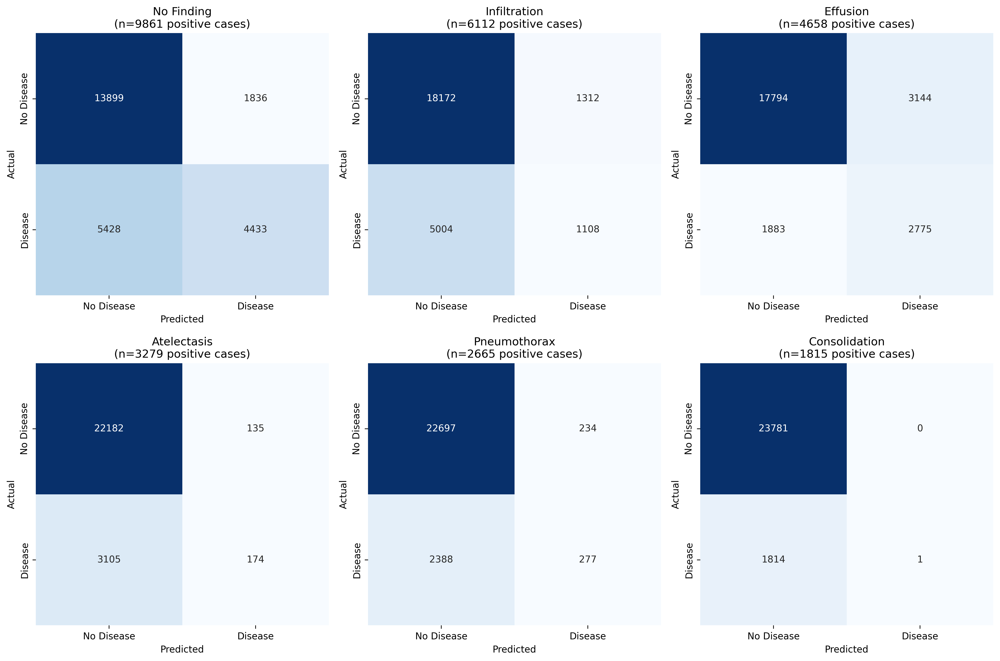

# Radiology CDS (DenseNet-169 + Grad-CAM + GPT-5)
A **Clinical Decision Support (CDS)** system for chest X-ray analysis using 
**deep learning (DenseNet-169), explainability (Grad-CAM), and GPT-5** to generate clinician-friendly and patient-friendly diagnostic reports.

<video src="https://github.com/mazshuky/Radiology-Report-Generator/blob/main/demo.mp4" width="600" controls>
</video>

## Features 
- Multi-label classification of 14 thoracic diseases + _No Finding_
- Grad-CAM overlays for visual explanation of model predictions
- GPT-5 powered reporting (patient-friendly or clinician-friendly)
- REST API (FastAPI) for integration into clinical workflows
- React UI for uploading images, viewing overlays, and reading reports 
- Built-in disclaimer for safe research use

## Tech Stack
- **Backend**: Python, FastAPI, PyTorch, OpenAI GPT-5
- **Frontend**: React, Tailwind CSS
- **Model**: DenseNet-169 pre-trained on [NIH Chest X-rays](https://www.kaggle.com/datasets/nih-chest-xrays/data) dataset 

## Project Structure
```              
├── requirements.txt              
├── densenet169_chestxray14.pth  
├── preprocess_data.py
├── train.py
├── evaluate.py   
├── radiology_cds_api.py        
├── assets/
│   ├── class_distribution.png
│   ├── confusion_matrices.png
│   └── roc_curves.png
├── dataset/
│   ├── images/
│   ├── Data_Entry_2017.csv
│   ├── test_list.csv
│   └── train_val_list.csv
├── frontend/                    
│   ├── cds-frontend/            
│   │   ├── src/                 
│   │   ├── public/               
│   │   └── package.json          
└── README.md                      
```

## Model Performance (DenseNet-169)
| Disease Distribution in Test Set                       | ROC Curves (AUC per Class)                                                     | Confusion Matrices                                                                       |
|--------------------------------------------------------|--------------------------------------------------------------------------------|------------------------------------------------------------------------------------------|
|  |  |  |

## Setup 
1. Install Python dependencies
   ```bash
   pip install -r requirements.txt
   ```
2. Install frontend dependencies
   ```bash
   cd frontend/cds-frontend
   npm install
   ```
3. Train or download model 
   Train:
      ```bash
      python train.py
     ```
   or place a trained model at `densenet169_chestxray14.pth`
 
4. Run Backend API
   ```bash
   python radiology_cds_api.py
   ```
5. Run Frontend
   ```bash
   cd frontend/cds-frontend
   npm start
   ```
6. Open in browser
   ```bash
   visit https://localhost:3000
   ```

## API Endpoints
- `POST /predict_and_report:` Upload X-ray + metadata, returns predictions, Grad-CAM overlays, and AI-generated report.
- `POST /predict:` X-ray to class probabilities and overlays.
- `POST /report:` Generate report from predictions.
- `GET /classes:` List of supported disease classes.

## Notes
- Set the `OPENAI_API-KEY` environment variable for GPT-5 report generation.
- For research/educational use only. Not a medical device. 